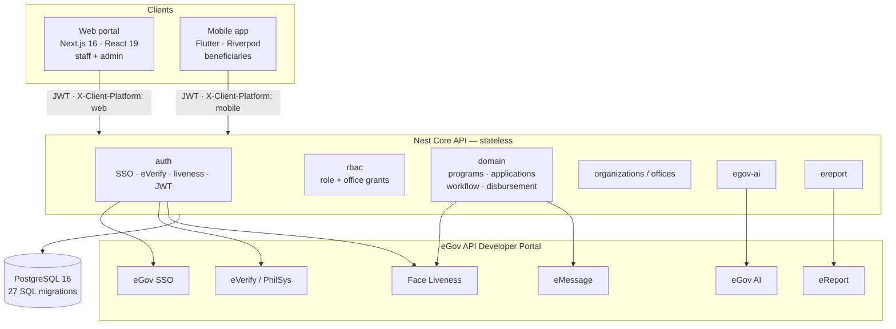
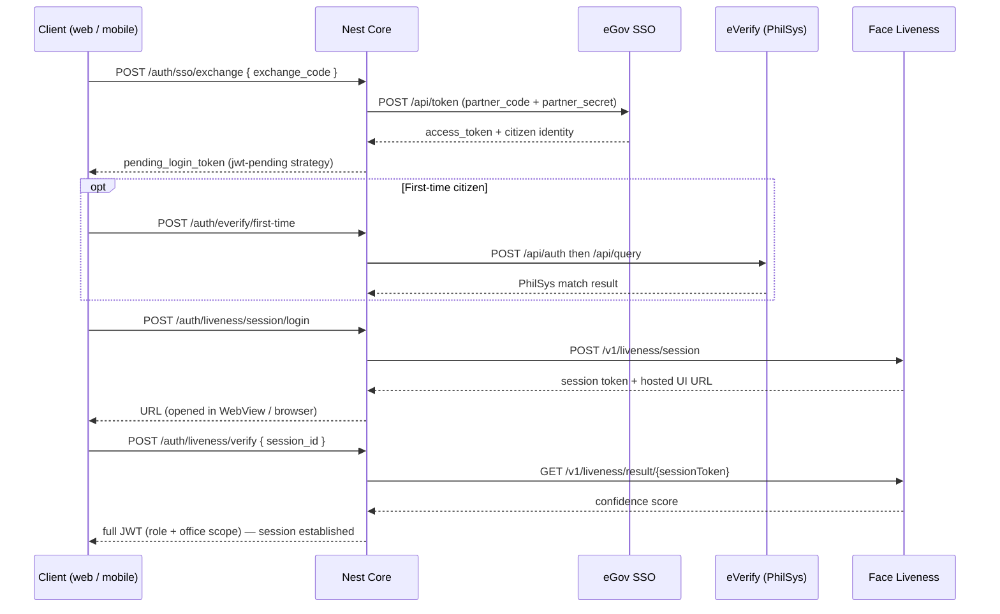

# EHELP — One Front Door to Philippine Government Financial Aid

> **eGovHackathon 2026 · DICT eGovernment Office**
> A cross-agency discovery, intake, and disbursement-orchestration layer built on the eGov API Developer Portal.

| | |
|---|---|
| **Demo video** | _(3–5 min, YouTube — unlisted or public)_ → `<YOUTUBE_LINK>` |
| **Repository** | https://github.com/melcomaniel/ehelp-platform |
| **eGov APIs used** | eGov SSO · eVerify (PhilSys) · Face Liveness · eGov AI · eReport · eMessage |
| **Clients** | Next.js web portal (staff & admin) · Flutter mobile app (citizens) |
| **Core** | NestJS + PostgreSQL |

---

## Table of contents

**Part 1 — What EHELP is (plain language)**
1. [The problem](#1-the-problem)
2. [What EHELP does](#2-what-ehelp-does)
3. [Who uses it](#3-who-uses-it)
4. [One application, end to end](#4-one-application-end-to-end)
5. [What EHELP deliberately does *not* do](#5-what-ehelp-deliberately-does-not-do)
6. [Where the eGov APIs fit](#6-where-the-egov-apis-fit-non-technical-view)

**Part 2 — How EHELP is built (technical)**

7. [Architecture](#7-architecture)
8. [Repository layout](#8-repository-layout)
9. [Technology stack](#9-technology-stack)
10. [eGov API integration points](#10-egov-api-integration-points)
11. [Authentication & session flow](#11-authentication--session-flow)
12. [Authorization model (RBAC + platform split)](#12-authorization-model-rbac--platform-split)
13. [Data model](#13-data-model)
14. [Prerequisites](#14-prerequisites)
15. [Quick start](#15-quick-start)
16. [Environment configuration](#16-environment-configuration)
17. [Mock mode vs live mode](#17-mock-mode-vs-live-mode)
18. [Demo accounts & mock SSO codes](#18-demo-accounts--mock-sso-codes)
19. [API surface](#19-api-surface)
20. [Tests, lint & type checks](#20-tests-lint--type-checks)
21. [Deployment](#21-deployment)
22. [Troubleshooting](#22-troubleshooting)
23. [Security notes](#23-security-notes)
24. [Documentation index](#24-documentation-index)

---
---

# Part 1 — What EHELP is

## 1. The problem

A Filipino who needs financial help from government today has to guess.

There are **15+ national agencies** running overlapping cash, livelihood, and subsidy programs — DSWD's 4Ps, AICS, AKAP and Social Pension; DOLE's TUPAD, DILP and JobStart; plus LGU "ayuda" — each with its own form, its own eligibility rules, its own office, and its own payout channel. **No single agency can tell a citizen what they qualify for across agencies.**

What that costs, on both sides of the counter:

**For the citizen**
- **Lost wages to get aid.** A day in a queue is a day of pay skipped.
- **Repeat trips.** Unclear requirements send people home to come back again.
- **No visibility.** Hours in line, weeks for a result, silence in between.

**For government**
- **Money leaves before controls catch it.** The Commission on Audit flagged roughly **₱926 million** in DSWD AKAP funds paid to unqualified recipients and duplicate payments. PSA's match of the legacy Listahanan-3 database against PhilSys surfaced **50,443** probable duplicate beneficiary records.
- **Findings arrive months late.** Audit is retrospective; there is no real-time control that blocks a duplicate release *before* the money moves.
- **Frontline staff carry the reconciliation.** CBMS and PhilSys records still disagree on spellings and addresses, and someone has to fix that by hand.

## 2. What EHELP does

EHELP is the **missing coordination layer**, not another payment app and not another super-app.

It gives one identity-verified front door where a citizen can:

1. **Discover** which programs they actually qualify for, across participating agencies.
2. **Apply once**, with identity already proven against PhilSys — no re-typing the same details per agency.
3. **Track status** in real time, instead of calling or queueing to ask.
4. **Book a claim slot** and show a one-time QR at the counter, instead of lining up at dawn.
5. **Raise a grievance** through an official channel and get a case number.

And it gives government a controlled pipeline where:

- Every application moves through a **configurable workflow** — evaluate → endorse → approve → disburse.
- **Separation of duties is enforced in code**: whoever endorses an application cannot approve that same application.
- Every claim is validated at the counter with a **QR token plus a live face check**, so the person collecting is the person approved.
- Every state change is written to an **audit trail** with the actor, the office, and the timestamp.
- Program capacity is scheduled as **disbursement slots**, so demand is metered instead of absorbed by a queue.

**The one-line pitch:** the citizen stops guessing, and the release of public money gains a real-time control point instead of a post-hoc audit finding.

## 3. Who uses it

Two channels, strictly separated. Citizens use the phone. Staff use the browser. The API enforces this — a staff account signing in on mobile is refused with `web_required`.

| Persona | Channel | What they own |
|---|---|---|
| **Beneficiary** (citizen) | Mobile app | Discover programs, apply, track status, upload documents, book a claim slot, show claim QR, file a grievance, ask the AI assistant |
| **Dependent** | Mobile app | Same app; linked to a principal beneficiary once an Office Admin approves the relationship |
| **Evaluator** | Web `/staff` | Reviews applications against program rules, endorses or declines |
| **Approver** | Web `/staff` | Final approve/reject decision — cannot be the same person who endorsed |
| **Office Admin** | Web `/admin` | Runs one office: schedules disbursement slots, validates claim QRs at the counter, approves relationships and profile changes |
| **Organization Admin** | Web `/admin` | Owns one agency tenant (e.g. DSWD): office hierarchy, program templates, workflows, oversight, grievance ledger |
| **Platform Admin** | Web `/admin` | Tenant and security steward: creates/suspends organizations and their admins, platform RBAC and audit — **cannot see beneficiary case PII and cannot decide cases** |

## 4. One application, end to end

```mermaid
sequenceDiagram
  autonumber
  participant OA as Org Admin (web)
  participant B as Beneficiary (mobile)
  participant E as Evaluator (web)
  participant A as Approver (web)
  participant Off as Office Admin (web)

  OA->>OA: Publish program, open period, create claim slots
  B->>B: Sign in (eGov SSO + PhilSys + face liveness)
  B->>B: Discover program, apply
  E->>E: Evaluate against rules, endorse
  A->>A: Approve or reject (different person than endorser)
  A-->>B: SMS + in-app notice with claim guidance
  B->>B: Book a disbursement slot
  B->>B: Show one-time claim QR on claim day
  Off->>Off: Scan QR, run claimant face liveness, release
  B->>B: Claim recorded, program cooldown starts
  opt Grievance
    B->>B: File report, receive case number
    OA->>OA: Read Appeals ledger (read-only oversight)
  end
```

| Step | Who | Where | Outcome |
|---|---|---|---|
| 1. Configure program & slots | Org Admin | `/admin/programs`, `/admin/disbursement-slots` | Program open; slots ≥ 2 days ahead |
| 2. Citizen applies | Beneficiary | Mobile | Application enters evaluation |
| 3. Endorse | Evaluator | `/staff` | Recommended for decision |
| 4. Decide | Approver | `/staff` | Approved / rejected + notification |
| 5. Book claim | Beneficiary | Mobile → Schedule | Slot booking with queue number |
| 6. Claim day | Office Admin + Beneficiary | `/admin/disbursement-validate` + mobile QR | Disbursed / claimed |
| 7. Relationships *(optional)* | Two citizens + Office Admin | Mobile request → `/admin` approve | Dependent / guardian link active |
| 8. Grievance *(optional)* | Beneficiary → Org Admin | Mobile `/customer/report` → `/admin/appeals` | Case number issued |

## 5. What EHELP deliberately does *not* do

Stated up front, because overclaiming is how aid platforms lose trust:

- **It is not the approving authority.** Discretionary judgment — who receives AICS, for example — stays with the agency's human decision-makers. EHELP records the decision; it does not make it.
- **It does not build a payment rail.** eGovPay is DICT's gateway and is the intended payout target. EHELP orchestrates *up to* the release and records the outcome.
- **It cannot fix budget-gated delay.** Many rollouts wait on GAA allocation and DBM fund release (SARO / NCA), not on paperwork. An app cannot shorten that, and this submission does not claim it does.
- **Appeals are a grievance channel, not an appeal court.** Filing an eReport case does not reopen a rejected application.
- **The AI assistant is guidance-only.** It cannot mutate applications, book slots, or decide cases.

## 6. Where the eGov APIs fit (non-technical view)

| eGov service | What it does for a citizen using EHELP |
|---|---|
| **eGov SSO** | One government sign-in. No new EHELP password to remember. |
| **eVerify (PhilSys)** | Proves the applicant is a real, registered person on first use — with consent — so duplicate and ghost beneficiaries are caught at intake instead of in an audit. |
| **Face Liveness** | Confirms a live human is present at sign-in *and* again at the payout counter, so an approved claim cannot be collected by someone else. |
| **eGov AI** | Answers "what do I qualify for?", "what's my status?", "where do I claim?" in plain language, grounded in the citizen's own case data. |
| **eReport** | Turns "I have a complaint" into a tracked government case number instead of an unanswered phone call. |
| **eMessage** | Sends the approval/rejection SMS with claim instructions, so the citizen doesn't have to keep checking. |

---
---

# Part 2 — How EHELP is built

## 7. Architecture

Three deployable pieces and one database. Both clients talk to the same stateless API; every eGov call is server-side only.



**Design rules**

1. **Stateless Core.** Sessions are Core-issued JWTs; any replica serves any request. No sticky sessions, no Redis in the baseline.
2. **Secrets never reach a client.** Partner codes, client secrets, and access codes live in the Nest process only. The web app receives exactly one public variable: the API base URL.
3. **Platform separation is enforced server-side.** `X-Client-Platform` gates web-only and mobile-only personas; a client cannot lie its way into the wrong console because roles are checked in Postgres.
4. **Every external integration degrades to mock.** Missing credentials produce a documented mock path, never a crash — the demo runs fully offline.
5. **Disbursement is idempotent by database key.** Claim tokens are single-use and validated with liveness at the counter.

The production target (multi-AZ Postgres, connection pooler, CloudFront + WAF, SQS payout worker, eGovPay) is specified in [`docs/architecture/ehelp-infrastructure-cost-techstack.md`](docs/architecture/ehelp-infrastructure-cost-techstack.md) with capacity bands and cost estimates.

## 8. Repository layout

```
.
├── backend/                    NestJS Core API
│   ├── src/
│   │   ├── auth/               eGov SSO exchange, eVerify, liveness, JWT, RBAC policy
│   │   │   └── providers/      live.providers.ts · mock.providers.ts · mock-sso-fixtures.ts
│   │   ├── domain/             programs, applications, workflow, disbursement, notifications
│   │   ├── organizations/      tenant lifecycle (platform + org scope)
│   │   ├── offices/            office hierarchy, staff requests
│   │   ├── rbac/               per-office grants + global template
│   │   ├── egov-ai/            eGov AI assistant proxy (+ local fallback)
│   │   ├── ereport/            grievance submit / list / OTP view token
│   │   └── common/             guards, decorators, shared helpers
│   ├── db/
│   │   ├── migrations/         001–027, applied in order
│   │   ├── seed/               001_bootstrap · 002_staff_accounts · 003_egov_sso_hackathon_accounts
│   │   └── init.sh             first-boot orchestrator for Docker Postgres
│   ├── Dockerfile              multi-stage build (node:22-slim)
│   └── fly.toml                container host config
│
├── web/client/                 Next.js 16 portal — staff & admin
│   ├── src/app/
│   │   ├── (auth)/             signin · signup · otp
│   │   ├── auth/               sso callback · liveness
│   │   ├── admin/              orgs · offices · accounts · programs · workflows ·
│   │   │                       slots · validate-claim · appeals · rbac · audit
│   │   └── staff/              evaluator / approver case work
│   ├── src/lib/                api client, workflow engine, admin helpers
│   └── src/middleware.ts       route protection
│
├── mobile/                     Flutter app — beneficiaries only
│   └── lib/
│       ├── config/             api_config.dart (compile-time API_BASE_URL)
│       ├── features/
│       │   ├── auth/           SSO, onboarding, OTP
│       │   ├── liveness/       WebView bridge for Face Liveness
│       │   └── customer/       apply · schedule · documents · dependents ·
│       │                       assistant · report-problem
│       ├── router/             go_router routes
│       └── services/           HTTP clients
│
├── docs/                       architecture · manual · discovery · design · eGov API reference
├── openspec/                   change specs
└── docker-compose.yml          Postgres 16 (host port 5433)
```

## 9. Technology stack

| Layer | Technology | Notes |
|---|---|---|
| **Core API** | NestJS 11, TypeScript 5.7, Node 22 | Stateless HTTP/JSON |
| **ORM / data** | TypeORM 0.3, `pg` | Schema owned by raw SQL migrations, not synchronize |
| **Auth** | `@nestjs/jwt`, Passport JWT, bcrypt | Two strategies: `jwt` (full session) and `jwt-pending` (post-SSO, pre-liveness) |
| **Validation** | `class-validator`, `class-transformer` | DTO validation at the boundary |
| **Database** | PostgreSQL 16 (Docker locally) | 27 ordered migrations + 3 seeds |
| **Web** | Next.js 16, React 19, Tailwind CSS 4, shadcn/Base UI, Recharts, Leaflet, `html5-qrcode` | App Router |
| **Mobile** | Flutter (Dart SDK ^3.10.7), Riverpod 3, go_router 17, `webview_flutter`, `mobile_scanner`, `qr_flutter`, `flutter_secure_storage` | Beneficiaries only |
| **Tests** | Jest + Supertest (backend), Vitest (web), `flutter_test` (mobile) | See §20 |
| **Lint / format** | ESLint 9 + Prettier (TS), `flutter analyze` (Dart) | |
| **Container** | Multi-stage Dockerfile, `node:22-bookworm-slim` | Runtime ships compiled JS + prod deps only |

## 10. eGov API integration points

All six integrations are **server-side only**. No credential is ever shipped to the web bundle or the APK.

| # | eGov service | Where in code | Endpoints called | Env vars |
|---|---|---|---|---|
| 1 | **eGov SSO** | [`backend/src/auth/providers/live.providers.ts`](backend/src/auth/providers/live.providers.ts) · [`auth.controller.ts`](backend/src/auth/auth.controller.ts) | `POST /api/token` (exchange code → access token) | `EGOV_SSO_BASE_URL`, `EGOV_PARTNER_CODE`, `EGOV_PARTNER_SECRET`, `EGOV_SSO_CALLBACK_PATH` |
| 2 | **eVerify (PhilSys)** | `live.providers.ts` | `POST /api/auth`, `POST /api/query` (verify personal info), `POST /api/query/qr/check`, `POST /api/query/qr` | `EVERIFY_BASE_URL`, `EVERIFY_CLIENT_ID`, `EVERIFY_CLIENT_SECRET`, `EVERIFY_PUBKEY` |
| 3 | **Face Liveness** | `live.providers.ts` · [`domain.controller.ts`](backend/src/domain/domain.controller.ts) (claim validation) | `POST /v1/liveness/session`, `GET /v1/liveness/result/{sessionToken}` | `FACE_LIVENESS_BASE_URL`, `FACE_LIVENESS_API_KEY`, `FACE_LIVENESS_MIN_CONFIDENCE`, `EVERIFY_LIVENESS_HOST` |
| 4 | **eGov AI** | [`backend/src/egov-ai/egov-ai.service.ts`](backend/src/egov-ai/egov-ai.service.ts) | `POST /api/v1/egov/integration/token`, `POST /api/v1/egov/integration/ai_assistant/generate` | `EGOV_AI_BASE_URL`, `EGOV_AI_ACCESS_CODE`, `EGOV_AI_FALLBACK_MOCK` |
| 5 | **eReport** | [`backend/src/ereport/ereport.service.ts`](backend/src/ereport/ereport.service.ts) | `POST /api/integration/token`, `POST /api/integration/submit_complaint`, `GET /api/integration/reports`, `GET /api/integration/reports/{ref}`, `POST /api/integration/verify/request`, `POST /api/integration/verify/confirm` | `EREPORT_BASE_URL`, `EREPORT_ACCESS_CODE` *(or* `EREPORT_ACCESS_TOKEN`*)*, `EREPORT_REPORT_VIEW_TOKEN`, `EREPORT_DEFAULT_*` PSA codes |
| 6 | **eMessage** | [`backend/src/domain/office-ops.service.ts`](backend/src/domain/office-ops.service.ts) | `POST /messaging/v1/sms/push` (header `X-EMESSAGE-Auth`) | `EMESSAGE_BASE_URL`, `EMESSAGE_ACCESS_TOKEN` |

### API Developer Portal base URLs

Set these in `backend/.env` for the graded run. They override the legacy staging fallbacks still present as defaults in `.env.example` and in a few service-level constants.

```dotenv
EGOV_SSO_BASE_URL=https://platforms-api.e.gov.ph/egov-sso
EVERIFY_BASE_URL=https://platforms-api.e.gov.ph/everify
EMESSAGE_BASE_URL=https://platforms-api.e.gov.ph/emessage
EGOV_AI_BASE_URL=https://platforms-api.e.gov.ph/egov-ai
EREPORT_BASE_URL=https://platforms-api.e.gov.ph/ereport
FACE_LIVENESS_BASE_URL=https://platforms-api.e.gov.ph/face-liveness
```

> **Credentials are never committed.** Every value above pairs with a partner code, client secret, token, or access code that is supplied only through a local, git-ignored `backend/.env`. `.gitignore` excludes `.env*` except `.env.example`.

### Integration failure behavior

Each integration has an explicit degraded path, so a portal outage never takes down a case decision:

| Integration | On missing credentials | On upstream error |
|---|---|---|
| eGov SSO | Mock fixture codes (§18) | 4xx surfaced to client with reason |
| eVerify | Auto-pass mock adapter | Registration blocked with explicit error |
| Face Liveness | Simulated pass, mock UI page | Session/verify error surfaced |
| eGov AI | Local grounded answers from case context | Falls back to local when `EGOV_AI_FALLBACK_MOCK=true` |
| eReport | Local `EHELP-…` case numbers in `ereport_cases` | Still writes the local case, so the citizen keeps a reference |
| eMessage | SMS silently skipped | Soft-fail + warn log; the decision is already committed |

## 11. Authentication & session flow

Every persona follows the same three-legged sequence. The intermediate token cannot do anything except complete liveness.



Notes for reviewers:

- **Two Passport strategies.** [`jwt-pending.strategy.ts`](backend/src/auth/jwt-pending.strategy.ts) issues a scoped token valid only for the liveness leg; [`jwt.strategy.ts`](backend/src/auth/jwt.strategy.ts) issues the real session. A pending token cannot reach domain endpoints.
- **Liveness must run in a top-level secure context.** Nest returns the official HTTPS Face Liveness URL and the mobile app injects a bridge to capture `session_id`. Serving that page over plain HTTP or in a nested iframe fails camera permission — this is why the app opens the vendor URL rather than proxying it.
- **Provisioning asymmetry is intentional.** Web staff must be provisioned first (seed or Admin → Accounts). Mobile beneficiaries are auto-created on first successful SSO.
- `GET /auth/provider-mode` reports which adapters are mock vs live — useful to confirm the demo posture before recording.

## 12. Authorization model (RBAC + platform split)

Three independent checks run on every protected request:

1. **Platform policy** — [`platform-policy.ts`](backend/src/auth/platform-policy.ts). `X-Client-Platform: web|mobile` against the account's persona. Staff on mobile → **403 `web_required`**. Beneficiary on web → routed to `/get-app`.
2. **Role policy** — [`rbac.policy.ts`](backend/src/auth/rbac.policy.ts), covered by [`rbac.policy.spec.ts`](backend/src/auth/rbac.policy.spec.ts). Roles: `PLATFORM_ADMIN`, `ORG_ADMIN`, `OFFICE_ADMIN`, `EVALUATOR`, `APPROVER`, `BENEFICIARY`, `DEPENDENT`.
3. **Scope resolution** — [`rbac-access.service.ts`](backend/src/auth/rbac-access.service.ts). Org-scoped vs office-scoped visibility, plus per-office grants configurable at `/admin/rbac` with a global template.

Two invariants worth pointing at during review:

- **Separation of duties on decisions.** The user who calls `POST /applications/:id/recommend` is blocked from `POST /applications/:id/decide` on that same application.
- **Platform Admin is a security role, not a case role.** It can create and suspend organizations and org admins but has no path to beneficiary case PII and no decision endpoint.

## 13. Data model

Schema is owned by **raw SQL migrations**, applied in numeric order — TypeORM `synchronize` is not used.

| Range | Concern |
|---|---|
| `001` | Extensions |
| `002`–`003` | Tenancy, identity, relationships (dependent / guardian links) |
| `004`–`005` | Programs, rules, workflow templates, applications |
| `006` | Disbursement |
| `007`–`009` | Platform services, application compatibility, staff profiles |
| `010`–`018` | Organization & office management, RBAC configuration, audit actions |
| `019` | Workflow templates |
| `020` | Login liveness records |
| `021`–`023` | Profile-change requests, disbursement slots, slot↔program link |
| `024`–`026` | Claim token, claim liveness, claimed status |
| `027` | `ereport_cases` (grievance ledger) |

Per project convention, a column belongs to a table only if it describes that table's entity; cross-domain data gets its own table plus a foreign key.

**Seeds**

| Seed | Contents |
|---|---|
| `001_bootstrap.sql` | Organization, office hierarchy, roles, RBAC defaults |
| `002_staff_accounts.sql` | Demo staff logins (**local development only**) |
| `003_egov_sso_hackathon_accounts.sql` | `sso*` fixture accounts for mock-SSO demos |

> ⚠️ `002_staff_accounts.sql` and `003_egov_sso_hackathon_accounts.sql` create **publicly documented** demo credentials. Never run them against a shared or public deployment.

## 14. Prerequisites

| Tool | Version | Needed for |
|---|---|---|
| **Node.js** | 20+ (22 recommended — matches the Docker image) | Backend + web |
| **npm** | 10+ | Both JS packages |
| **Docker Desktop** | current | PostgreSQL 16 |
| **Flutter SDK** | stable, Dart `^3.10.7` | Mobile app |
| **Xcode / Android Studio** | current | Simulator / emulator |

Physical-device testing additionally needs the phone on the same Wi-Fi as the host machine.

## 15. Quick start

Three terminals from the repository root.

### Terminal 1 — PostgreSQL

```bash
docker compose up -d
```

First boot runs [`backend/db/init.sh`](backend/db/init.sh): all migrations, then all seeds. Postgres is published on **host port 5433** to avoid clashing with an existing local Postgres.

Reset to a clean database at any time:

```bash
docker compose down -v && docker compose up -d
```

### Terminal 2 — Nest Core API

```bash
cd backend
cp .env.example .env          # then fill credentials per §16
npm install
npm run start:dev             # http://127.0.0.1:3001, binds 0.0.0.0
```

Confirm the boot log line — it prints the active adapter modes:

```
Auth adapters: base=… sso=… everify=… liveness=…
```

> **`.env` changes do not reliably hot-reload.** Stop Nest with `Ctrl+C` and run `npm run start:dev` again after editing `.env`.

### Terminal 3 — Web portal

```bash
cd web/client
cp .env.example .env.local
npm install
npm run dev                   # http://localhost:3000
```

Open `http://localhost:3000/signin`.

### Mobile app

The Flutter app takes its API base URL at **compile time**, so pick the value that matches your device:

```bash
cd mobile
flutter pub get

# iOS Simulator / desktop
flutter run --dart-define=API_BASE_URL=http://127.0.0.1:3001

# Android emulator
flutter run --dart-define=API_BASE_URL=http://10.0.2.2:3001

# Physical phone on the same Wi-Fi — use THIS machine's current LAN IP
flutter run --dart-define=API_BASE_URL=http://192.168.x.x:3001
```

Find your LAN IP on macOS with `ipconfig getifaddr en0`. Do **not** commit a teammate's IP — always pass it via `--dart-define`.

Smoke-test reachability from the phone's browser: `http://<LAN_IP>:3001/auth/me` should return JSON or a 401, not "unreachable". If it hangs, allow inbound connections to Node on port 3001 in the host firewall.

## 16. Environment configuration

### `backend/.env` — the only file holding secrets

Copy from [`backend/.env.example`](backend/.env.example).

**Core runtime**

| Variable | Default | Notes |
|---|---|---|
| `PORT` | `3001` | Nest listen port |
| `DATABASE_HOST` | `localhost` | |
| `DATABASE_PORT` | `5433` | Must match `docker-compose.yml` |
| `DATABASE_USER` / `DATABASE_PASSWORD` / `DATABASE_NAME` | `ehelp` | Match Compose |
| `JWT_SECRET` | dev placeholder | **Replace before any non-local use** |
| `JWT_EXPIRES_IN` | `7d` | |
| `CORS_ORIGINS` | `*` | Fine locally; restrict in deployment |
| `WEB_APP_URL` | `http://localhost:3000` | Used when the SSO callback carries `?client=web` |
| `PUBLIC_API_BASE_URL` | *(unset)* | Per-machine; set to `http://<LAN_IP>:3001` if mock liveness still opens `127.0.0.1` on a physical phone |

**Adapter modes**

| Variable | Values | Notes |
|---|---|---|
| `AUTH_PROVIDER_MODE` | `mock` \| `live` | Global default for all three auth adapters |
| `AUTH_SSO_MODE` | `mock` \| `live` | Per-adapter override |
| `AUTH_EVERIFY_MODE` | `mock` \| `live` | Per-adapter override |
| `AUTH_LIVENESS_MODE` | `mock` \| `live` | Per-adapter override |

**eGov credentials** — supply from the API Developer Portal; leave blank to stay in mock.

| Variable | Service |
|---|---|
| `EGOV_SSO_BASE_URL`, `EGOV_PARTNER_CODE`, `EGOV_PARTNER_SECRET`, `EGOV_SSO_CALLBACK_PATH` | eGov SSO |
| `EVERIFY_BASE_URL`, `EVERIFY_CLIENT_ID`, `EVERIFY_CLIENT_SECRET`, `EVERIFY_PUBKEY`, `EVERIFY_LIVENESS_HOST` | eVerify / PhilSys + hosted liveness UI |
| `FACE_LIVENESS_BASE_URL`, `FACE_LIVENESS_API_KEY`, `FACE_LIVENESS_MIN_CONFIDENCE` | Face Liveness (`MIN_CONFIDENCE` defaults to `95`) |
| `EGOV_AI_BASE_URL`, `EGOV_AI_ACCESS_CODE`, `EGOV_AI_FALLBACK_MOCK` | eGov AI |
| `EREPORT_BASE_URL`, `EREPORT_ACCESS_CODE` *or* `EREPORT_ACCESS_TOKEN`, `EREPORT_REPORT_VIEW_TOKEN` | eReport (prefer `ACCESS_CODE` — it mints a short-lived bearer) |
| `EREPORT_ADMIN_REGION_CODE`, `EREPORT_DEFAULT_REGION_CODE`, `EREPORT_DEFAULT_PROVINCE_CODE`, `EREPORT_DEFAULT_MUNICIPALITY_CODE`, `EREPORT_DEFAULT_BARANGAY_CODE` | PSA geo codes used when a beneficiary has no geo data |
| `EMESSAGE_BASE_URL`, `EMESSAGE_ACCESS_TOKEN` | eMessage SMS |

Fill them like this — values come from your own portal account, never from this file:

```dotenv
EGOV_PARTNER_CODE=<your_partner_code>
EGOV_PARTNER_SECRET=<your_partner_secret>
EVERIFY_CLIENT_ID=<your_client_id>
EVERIFY_CLIENT_SECRET=<your_client_secret>
EVERIFY_PUBKEY=<your_everify_pubkey>
FACE_LIVENESS_API_KEY=<your_face_liveness_token>
EGOV_AI_ACCESS_CODE=<your_egov_ai_access_code>
EREPORT_ACCESS_CODE=<your_ereport_access_code>
EMESSAGE_ACCESS_TOKEN=<your_emessage_token>
```

### `web/client/.env.local` — public values only

| Variable | Required | Example |
|---|---|---|
| `NEXT_PUBLIC_API_BASE_URL` | **yes** | `http://127.0.0.1:3001` |
| `API_BASE_URL` | no | Server-side override; defaults to the public value |

Never put a Nest secret or JWT key in the web environment — it ships to the browser.

### Mobile

No committed `.env` is required. `mobile/.env.example` is notes only; Flutter reads `API_BASE_URL` via `--dart-define` (default in [`mobile/lib/config/api_config.dart`](mobile/lib/config/api_config.dart) is `http://127.0.0.1:3001`).

### Per-machine values to revisit on a new clone

| What | Where | When it changes |
|---|---|---|
| Host LAN IP | `--dart-define=API_BASE_URL` | New machine, new Wi-Fi, physical device |
| Postgres host port | `docker-compose.yml` + `DATABASE_PORT` | Port 5433 already taken |
| Nest port | `PORT` + every `API_BASE_URL` | Port 3001 already taken |
| `JWT_SECRET` | `backend/.env` | Any shared or production-like environment |

## 17. Mock mode vs live mode

Adapters are independent, so you can demo a real camera against mock sign-in codes.

| Posture | Configuration | Use for |
|---|---|---|
| **Fully offline** | `AUTH_PROVIDER_MODE=mock`, no integration credentials | Development, CI, no-network demos |
| **Hybrid (recommended for video)** | `AUTH_PROVIDER_MODE=mock` + `AUTH_LIVENESS_MODE=live` | Real Face Liveness camera with deterministic fixture logins |
| **Fully live** | `AUTH_PROVIDER_MODE=live` + all credentials | Real eGov SSO, PhilSys eVerify, and Face Liveness |

Hybrid, exactly:

```dotenv
AUTH_PROVIDER_MODE=mock
AUTH_SSO_MODE=mock
AUTH_EVERIFY_MODE=mock
AUTH_LIVENESS_MODE=live
```

Integration mocks are keyed off credential presence, not a mode flag:

| Integration | Mock trigger | Live behavior |
|---|---|---|
| eGov AI | `EGOV_AI_ACCESS_CODE` unset | Calls eGov AI; local grounded fallback if `EGOV_AI_FALLBACK_MOCK=true` |
| eReport | `EREPORT_ACCESS_CODE` / `_TOKEN` unset | Submits upstream; on failure still writes a local case |
| eMessage | `EMESSAGE_ACCESS_TOKEN` unset | Pushes SMS; soft-fails without blocking the decision |

## 18. Demo accounts & mock SSO codes

Available when `AUTH_SSO_MODE=mock` and seeds `001`–`003` are loaded.

**Web — paste on `/signin`**

| Code | Persona | Lands on |
|---|---|---|
| `platform` | Platform Admin | `/admin` |
| `orgadmin` | Organization Admin | `/admin` |
| `officeadmin` | Office Admin | `/admin` |
| `evaluator` | Evaluator | `/staff` |
| `approver` | Approver | `/staff` |

Aliases `ssoplatform` … `ssoapprover` come from seed `003`.

**Mobile — paste in the app's SSO dialog**

| Code | Persona |
|---|---|
| `beneficiary` | Primary citizen (main demo applicant) |
| `beneficiary2` | Second citizen, for relationship linking |
| `dependent` | Dependent-class citizen |

Optional `mock:` prefix is accepted (e.g. `mock:beneficiary`).

**Seeded hierarchy**

```
DSWD
 └── DSWD Central Office          ← hierarchy root
     └── DSWD NCR / NCR Field     ← officeadmin, evaluator, approver
```

Org Admin is **org-scoped** (no office). Office Admin's application list is scoped to the regional office.

### Demo script for the video

1. **Org Admin** (`orgadmin`) — confirm the program disbursement window, create an open slot ≥ 2 days ahead.
2. **Beneficiary** (`beneficiary`) — apply; optionally ask the eGov AI assistant first.
3. **Evaluator** (`evaluator`) — endorse.
4. **Approver** (`approver`) — approve. Note this must be a different user than step 3.
5. **Beneficiary** — Schedule → book slot → open the program **Disbursement QR**.
6. **Office Admin** (`officeadmin`) — `/admin/disbursement-validate` → scan QR → claimant face liveness → complete claim.
7. *Optional:* `beneficiary` + `dependent` request a relationship link → Office Admin approves with proof.
8. *Optional:* Beneficiary files **Report a problem** → note the case number → Org Admin opens `/admin/appeals`.

## 19. API surface

Full definitions live in the controllers; this is the shape.

| Group | Base | Highlights |
|---|---|---|
| **Auth** | `/auth` | `GET /egovph/sso` · `POST /sso/exchange` · `POST /login/complete` · `POST /liveness/session` · `POST /liveness/verify` · `POST /everify/first-time` · `GET /me` · `GET /provider-mode` |
| **Programs & applications** | `/` | `GET /programs` · `POST /applications` · `POST /applications/:id/submit` · `POST /applications/:id/recommend` · `POST /applications/:id/decline` · `POST /applications/:id/decide` · `GET /applications/queue` |
| **Disbursement** | `/` | `POST /admin/disbursement-slots` · `GET /disbursement-slots` · `POST /disbursement-bookings` · `POST /admin/disbursement-claims/preview` · `POST /admin/disbursement-claims/liveness-session` · `POST /admin/disbursement-claims/validate` |
| **Relationships** | `/relationships` | request · validate · approve · list dependents / principals |
| **Profile changes** | `/profile-change-requests` | citizen submits, admin decides |
| **Documents** | `/beneficiary-documents`, `/uploads` | Document vault |
| **Organizations** | `/admin/organizations`, `/platform/organizations` | Create, suspend, reactivate, archive; admin management |
| **Offices** | `/admin/offices`, `/organizations/:id/offices` | Hierarchy, staff requests, archive/reactivate |
| **RBAC** | `/admin/rbac` | Per-office grants, global template, apply-to-all |
| **eGov AI** | `/integrations/egov-ai` | `GET /status` · `POST /assistant` |
| **eReport** | `/integrations/ereport`, `/admin/ereport` | `GET /categories` · `POST /complaints` · `GET /my-cases` · `GET /reports` · `POST /view-token/request` · `POST /view-token/confirm` |
| **Notifications** | `/notifications` | `GET /me` · `POST /:id/read` |

Every protected route requires `Authorization: Bearer <jwt>` **and** `X-Client-Platform: web|mobile`.

## 20. Tests, lint & type checks

```bash
# Backend — unit + e2e
cd backend
npm test                 # Jest (*.spec.ts under src/)
npm run test:cov         # coverage
npm run test:e2e         # Supertest, test/jest-e2e.json
npm run lint             # ESLint + Prettier, --fix
npm run build            # nest build — doubles as the type check

# Web
cd web/client
npm test                 # Vitest
npm run lint             # eslint-config-next
npm run build            # next build — type check + production bundle

# Mobile
cd mobile
flutter analyze
flutter test
```

Backend specs cover the parts most worth guarding: `auth-provider-mode.spec.ts` (adapter resolution), `rbac.policy.spec.ts` and `rbac-access.service.spec.ts` (authorization), `domain.rbac.spec.ts` and `domain.archive.spec.ts` (scoped domain access). Web unit tests cover the workflow engine and admin org/office helpers.

## 21. Deployment

**API** — containerized via [`backend/Dockerfile`](backend/Dockerfile) (multi-stage; the runtime image ships only compiled JS and production dependencies). It listens on `PORT`, defaulting to `8080` in the image. [`backend/fly.toml`](backend/fly.toml) is a working example: build context `backend/`, internal port 8080, `force_https`.

**Web** — standard Next.js build (`npm run build` → `npm start`), or any Next-compatible host. Set `NEXT_PUBLIC_API_BASE_URL` to the deployed API origin.

**Mobile** — build with the hosted API baked in:

```bash
flutter build apk --dart-define=API_BASE_URL=https://<your-api-host>
```

**Database** — provision managed Postgres, then apply `backend/db/migrations/001` … `027` in order. Load seed `001_bootstrap.sql` only. **Do not** load seeds `002` or `003` outside local development — they create publicly documented credentials.

Deployment checklist:

- [ ] `JWT_SECRET` replaced with a strong random value
- [ ] `CORS_ORIGINS` narrowed to the actual web origin
- [ ] All eGov credentials injected as platform secrets, never in the image
- [ ] Migrations `001`–`027` applied; seeds `002`/`003` **not** applied
- [ ] `NEXT_PUBLIC_API_BASE_URL` pointing at the deployed API
- [ ] `GET /auth/provider-mode` reporting the intended adapter posture

## 22. Troubleshooting

| Symptom | Fix |
|---|---|
| Web shows "not provisioned" | Load seed `002`, or provision the account under Admin → Accounts. Fixture code must match a staff email. |
| Mobile returns 403 `web_required` | That account is staff. Staff use the web portal. |
| Mock SSO works but the camera is fake | Set `AUTH_LIVENESS_MODE=live` and **restart** Nest. |
| Live SSO fires when you wanted fixture codes | Keep `AUTH_SSO_MODE=mock` even if `AUTH_PROVIDER_MODE=live`. |
| Liveness camera permission denied | The page must be top-level HTTPS. Use the Nest-returned official URL — not an HTTP page or a nested iframe. |
| Mock liveness opens `127.0.0.1` on a physical phone | Set `PUBLIC_API_BASE_URL=http://<LAN_IP>:3001` in your private `.env`. |
| AI assistant always answers in mock | Expected without `EGOV_AI_ACCESS_CODE`. Set it and restart Nest. |
| Appeals list is empty | The beneficiary needs both email and phone; file a report first; only Org Admin can see `/admin/appeals`. |
| Cannot create or book a slot | Slots and rebooking enforce a **2-day** minimum lead (`DISBURSEMENT_SLOT_MIN_LEAD_DAYS`). |
| Claim QR missing | Requires an approved application **and** an active disbursement booking. |
| App not reaching the API | Release builds use the compile-time default. Local override needs `--dart-define=API_BASE_URL=...`. |
| Empty database after deploy | Migrations were not applied. Run `001`–`027` in order. |
| `.env` edit had no effect | Stop Nest (`Ctrl+C`) and run `npm run start:dev` again. |

## 23. Security notes

- **No secret is committed.** `.gitignore` excludes `.env*` except `.env.example`. Every eGov credential is read from the environment at runtime and stays inside the Nest process.
- **No secret reaches a client.** The web app receives only `NEXT_PUBLIC_API_BASE_URL`. The mobile app receives only `API_BASE_URL`. All eGov calls are server-to-server.
- **Seeded demo credentials are local-only.** `002_staff_accounts.sql` and `003_egov_sso_hackathon_accounts.sql` create publicly documented logins and must never run on a shared or public deployment.
- **Replace the development defaults.** `JWT_SECRET` and the `ehelp`/`ehelp` database credentials in `docker-compose.yml` are local conveniences, not deployment values.
- **Consent and minimization.** eVerify is called only during first-time registration, with citizen consent, and PhilSys responses are stored as verification outcomes rather than mirrored records.
- **Auditability.** Organization, office, RBAC, and case-decision changes are recorded with actor, scope, and timestamp; separation of duties on endorse-vs-approve is enforced server-side.
- **If a credential is ever exposed, rotate it in the API Developer Portal first**, then update the environment. Rotation is the fix; scrubbing history is not.

## 24. Documentation index

| Document | Contents |
|---|---|
| [`docs/manual/ehelp-system-manual.md`](docs/manual/ehelp-system-manual.md) | Operator guide: personas, capabilities, demo script, troubleshooting |
| [`docs/architecture/ehelp-infrastructure-cost-techstack.md`](docs/architecture/ehelp-infrastructure-cost-techstack.md) | Production architecture planes, capacity bands, cost-benefit, decision log |
| [`docs/discovery/idea-validation.md`](docs/discovery/idea-validation.md) | Problem validation, agency landscape, competitive positioning vs eGovPay / eGovPH |
| [`docs/eGov-API-Services-Documentation.md`](docs/eGov-API-Services-Documentation.md) | Reference for all nine portal services (credentials omitted) |
| [`docs/persona-scope-prd-alignment-summary.md`](docs/persona-scope-prd-alignment-summary.md) | Persona scope and limitations |
| [`docs/mobile/beneficiary-prd-alignment-summary.md`](docs/mobile/beneficiary-prd-alignment-summary.md) | Beneficiary mobile alignment |
| [`docs/design/workflow-engine-iterations.md`](docs/design/workflow-engine-iterations.md) · [`workflow-engine-step-palette.md`](docs/design/workflow-engine-step-palette.md) | Workflow engine design |
| [`backend/README.md`](backend/README.md) · [`web/client/README.md`](web/client/README.md) · [`mobile/README.md`](mobile/README.md) | Per-component setup detail |

---

Built for **eGovHackathon 2026**, DICT eGovernment Office.
