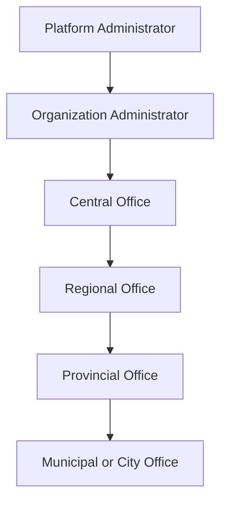
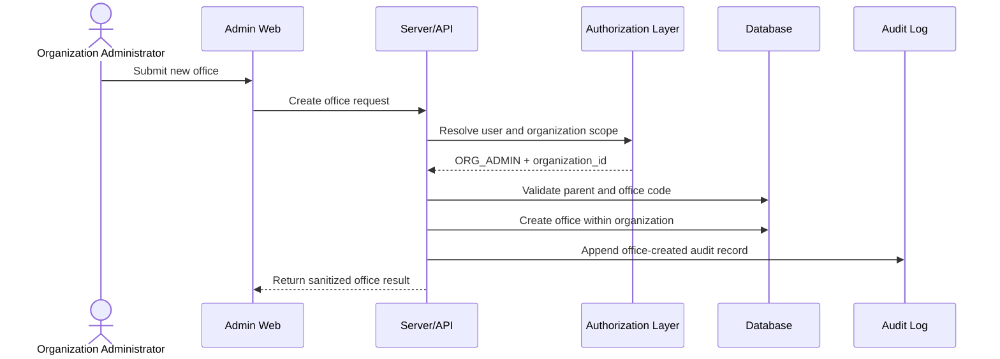

## Context

Repository inspection found:

- `backend/` is NestJS with TypeORM and PostgreSQL. Schema changes are ordered SQL under `backend/db/migrations`; `synchronize` is disabled.
- `web/client/` is Next.js App Router. Browser calls go through `/api/nest/*`, which forwards the httpOnly Nest JWT.
- `mobile/` is Flutter and beneficiary-only for this slice.
- eGov SSO, password login, `/auth/me`, role mapping, and web session handling already live in Nest auth.
- Existing entities include `organizations`, `offices`, `user_accounts`, `staff_profiles`, `roles`, `user_role_assignments`, and `audit_logs`.
- `offices` already has `organization_id`, `parent_office_id`, `name`, `level`, `status`, timestamps, and indexes, but lacks office code, normalized code uniqueness, archived metadata, and hierarchy integrity enforcement.
- Platform Organization Management already established `ORG_ADMIN` as tenant-scoped staff with a non-null organization and null office, and audit logs are append-only.
- The admin web console already has role-aware navigation, cards, badges, forms, and organization pages under `/admin`.

## Goals / Non-Goals

**Goals:**

- Deliver Organization Administrator office list, create, detail, edit, archive/deactivate, and reactivate operations.
- Reuse existing auth/session/proxy patterns.
- Enforce tenant scope by deriving `organization_id` from the authenticated server-side actor.
- Support multiple offices per organization and optional parent-child hierarchy.
- Prevent duplicate office codes within one organization and allow the same code across organizations.
- Preserve historical data through soft lifecycle changes and append-only audit logs.
- Add focused tests and documentation.

**Non-Goals:**

- Platform tenant CRUD, office-staff assignment, program-office customization, beneficiary/application workflows, permanent physical deletion, or a new admin application shell.

## Decisions

### 1. Add a focused Nest office-management module

Create an `offices` module with DTOs, controller, service, and policy helpers. Routes live under `/admin/offices` and use the existing JWT guard. The service reloads the actor from `user_accounts` and `user_role_assignments`, requires active `ORG_ADMIN`, requires exactly one active organization, and ignores client tenant scope.

Conceptual operations:

| Method | Route | Behavior |
|---|---|---|
| GET | `/admin/offices` | tenant-scoped search/filter/page list |
| POST | `/admin/offices` | create one active office in actor organization |
| GET | `/admin/offices/:officeId` | tenant-scoped office detail |
| PATCH | `/admin/offices/:officeId` | edit allowed office metadata |
| POST | `/admin/offices/:officeId/archive` | active to archived/inactive, reason required |
| POST | `/admin/offices/:officeId/reactivate` | archived/inactive to active |
| GET | `/admin/offices/parent-options` | active same-tenant parent choices |

Responses are sanitized JSON and standard Nest errors.

### 2. Extend the existing office table

Add migration `011_organization_admin_office_management.sql`:

- add `code TEXT`, `normalized_code TEXT`, `archived_at`, `lifecycle_reason`, `created_by_user_id`, and `updated_by_user_id`;
- backfill existing seeded offices with deterministic codes from current names/IDs;
- require non-empty `code` and `normalized_code`;
- add unique index on `(organization_id, normalized_code)`;
- add indexes for `organization_id`, `parent_office_id`, `status`, and normalized code;
- add checks for office status and direct self-parenting;
- add a trigger that prevents cross-organization parents and circular hierarchy;
- expand `audit_logs.action` check to include office actions.

The existing `level` column remains the office type for now (`central`, `regional`, `provincial`, `municipal`) because the schema already supports it. Unsupported address/contact/description fields are not added.

### 3. Normalize office codes consistently

If no local helper exists, normalize codes by trimming, uppercasing, and collapsing whitespace/separator runs to `_`. The stored `code` is the normalized value and `normalized_code` is used for uniqueness. Codes are unique inside one organization only.

### 4. Enforce hierarchy in service and database

Parent assignment validates that the parent exists in the same organization, is active, is not the same office, and is not a descendant. The service uses a recursive query before write; the database trigger provides a second integrity boundary for direct SQL writes.

### 5. Lifecycle is soft and auditable

Allowed office statuses are `active` and `archived`. Archive requires a reason and is rejected when the office has active direct child offices. Reactivation is rejected unless the organization is active. No ordinary endpoint physically deletes offices.

### 6. Audit in the same transaction

Create/update/archive/reactivate append audit rows with actor ID, organization ID, entity type `office`, office ID, before/after safe state, reason when relevant, request ID, and IP when available. Payloads reuse the existing sanitization helper and do not include secrets or beneficiary/application data.

### 7. Web UI follows existing admin patterns

Add:

- `/admin/offices` list with search, type/status/parent filters, pagination, empty/error states, and actions.
- `/admin/offices/new` create form with parent selector and no organization selector.
- `/admin/offices/[officeId]` detail page with office metadata, parent, direct children, status, timestamps, audit history, edit form, archive dialog, and reactivation dialog.

Sidebar exposes `Offices` only to Organization Administrators. UI hiding is not the security boundary.

## Diagrams

## Testing Strategy

- Unit tests for code normalization, role/scope checks, status transitions, parent validation, cycle prevention, and audit sanitization.
- Backend integration/e2e tests for create, duplicate rejection, same code across tenants, update, parent assignment, cross-tenant denial, archive child rejection, reactivation, suspended organization denial, and audit creation.
- Web tests where existing tools support API/error helpers and key UI states.
- Run OpenSpec validation, backend lint/test/build, web lint/build, and document any unrelated pre-existing failures.

## Rollback

Roll application code back first. To reverse schema, stop new office writes, retain/export new office lifecycle and audit history, drop the office hierarchy trigger/function, drop new office indexes/constraints/columns where compatible, and restore the prior `audit_logs.action` check. Ordinary rollback must not physically delete existing office or audit history without an explicit data-retention decision.
