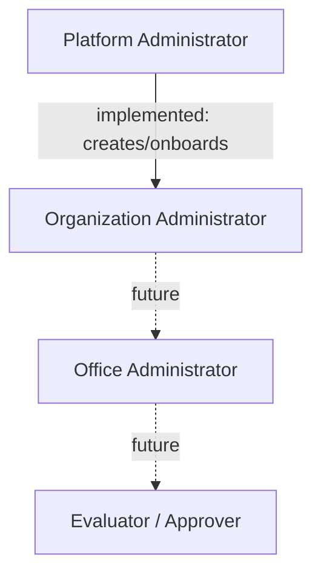
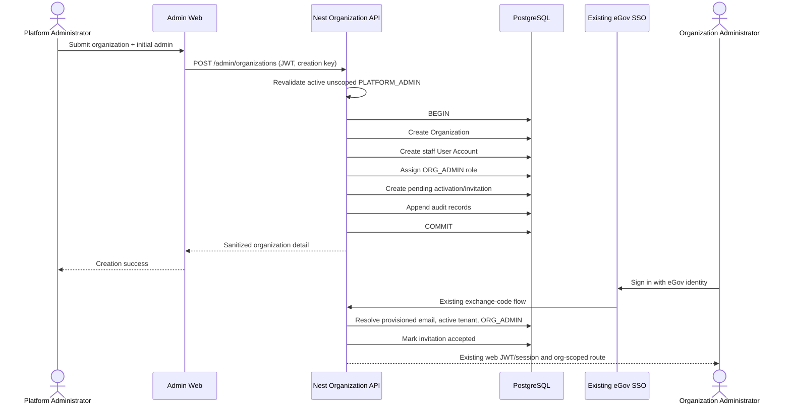

## Context

The repository is a three-client EHELP platform:

- `backend/` is NestJS 11 with TypeORM 0.3 and PostgreSQL 16. Schema evolution is ordered SQL in `backend/db/migrations`; `synchronize` is disabled.
- `web/client/` is Next.js 16 App Router and React 19. Browser calls use the existing `/api/nest/*` proxy, which reads an httpOnly Nest JWT cookie. Middleware performs coarse route redirects and Nest performs authoritative checks.
- `mobile/` is Flutter and is beneficiary-only.
- Authentication already centralizes eGov SSO in Nest providers. `POST /auth/sso/exchange` resolves an eGov identity to `user_accounts`, loads `user_role_assignments`, applies the mobile/web platform policy, and issues the same JWT consumed by web and mobile.
- Existing conceptual entities are `organizations`, `user_accounts`, `staff_profiles`, `roles`, `user_role_assignments`, and `audit_logs`. Organization codes are unique but not database-normalized, organizations only support active/suspended, Platform Administrator seed data is incorrectly tenant-scoped, audit action values cannot represent administration, and no invitation entity exists.
- Existing domain authorization treats `PLATFORM_ADMIN` as generic staff for application access. This conflicts with the required separation of platform oversight from beneficiary-level operations and must be narrowed.
- The admin UI already has a role-aware sidebar, breadcrumb layout, cards, forms, status badges, and the authenticated Nest proxy. It has no organization routes.

Organization is the tenant boundary because all existing tenant-owned offices, programs, applications, relationships, and platform service records carry `organization_id`. Platform Administrators are shared-platform operators and therefore have `organization_id = null` and `office_id = null`; Organization Administrators are staff with one non-null organization and no office in this slice.

## Goals / Non-Goals

**Goals:**

- Deliver server-enforced Platform Administrator organization listing, detail, creation, editing, suspension, reactivation, and archival.
- Atomically create an organization, initial active/pending Organization Administrator, `ORG_ADMIN` assignment, one activation/invitation record, and audit entries.
- Reuse the existing SSO provider/exchange/account lookup/JWT/web-cookie flow.
- Enforce status, role, platform scope, tenant scope, and prohibited business-data access on every protected server request.
- Manage Organization Administrator metadata and suspension without enabling cross-tenant or business-operation authority.
- Preserve all tenant history, provide append-only sanitized audits, and prevent duplicate normalized codes or repeated onboarding.
- Add accessible, responsive list/detail/create/edit/actions UI using existing conventions.

**Non-Goals:**

- Office CRUD or management of Office Administrators, Evaluators, or Approvers.
- Beneficiary, application, document, evaluation, approval, program/rule/workflow, recommendation, or disbursement functions.
- Permanent deletion, a parallel SSO implementation, outbound email delivery, a full Organization Administrator dashboard, or a broad admin redesign.

## Decisions

### 1. Add a focused Nest organization-management module

Create an `organizations` module with entities, DTO validation, controller, service, and policy helpers. Routes live under `/admin/organizations` and use the existing JWT guard plus an authoritative service guard that reloads actor state and role assignment. TypeORM repositories and `DataSource.transaction` match the current stack.

Alternative considered: place operations in `AuthService`. Rejected because tenant lifecycle and audits are a separate bounded concern; only shared account-resolution/status helpers belong in auth.

Conceptual operations:

| Method | Route | Behavior |
|---|---|---|
| GET | `/admin/organizations` | search/status/page list |
| GET | `/admin/organizations/admins` | search/status/invitation/page Organization Admin directory |
| POST | `/admin/organizations` | atomic tenant + initial admin onboarding |
| GET | `/admin/organizations/:id` | metadata, counts, Organization Administrators, audits |
| GET | `/admin/organizations/:id/offices` | search/status/type/page office list for one organization |
| PATCH | `/admin/organizations/:id` | allowed metadata only |
| POST | `/admin/organizations/:id/suspend` | active to suspended, reason required |
| POST | `/admin/organizations/:id/reactivate` | suspended to active |
| POST | `/admin/organizations/:id/archive` | suspended to archived, reason required |
| PATCH | `/admin/organizations/:id/admins/:adminId` | allowed admin profile metadata |
| POST | `/admin/organizations/:id/admins/:adminId/suspend` | independently suspend admin |

Responses are sanitized DTO-shaped JSON and use Nest standard 400/401/403/404/409 errors.

### 2. Make lifecycle and integrity database-enforced where practical

Add ordered migration `010_platform_admin_organization_management.sql`:

- extend organization status to `active`, `suspended`, `archived`;
- add lifecycle reason/timestamps and an optional `creation_key` unique idempotency value;
- make organization code uniqueness case-insensitive over normalized values with a unique index on `upper(code)`;
- add `organization_invitations` with a unique partial index allowing one active invitation per user/organization and no raw authentication secret;
- expand `audit_logs.action`, add outcome/reason/request metadata, and install update/delete rejection triggers;
- add constraints/triggers for Platform Administrator null scope and `ORG_ADMIN` non-null tenant/no-office scope;
- repair the known seeded Platform Administrator scope to null.

Alternative considered: application checks only. Rejected because concurrency and direct database writes could violate uniqueness, scope, invitation, and append-only guarantees.

Migration is forward-only during normal deployment but has documented reverse SQL. Rollback first deploys compatible old application code, then drops triggers/indexes/table/columns and restores prior checks. Historical archived/audit data must be retained or exported before destructive schema rollback.

### 3. Organization creation is one database transaction

`DataSource.transaction` validates and performs:

1. normalize code to uppercase and email to lowercase;
2. lock/check `creation_key`, organization code, email, and required `ORG_ADMIN` role;
3. insert active organization;
4. create a staff `user_account` with the new organization and null office;
5. create `staff_profile`;
6. create exactly one `ORG_ADMIN` assignment with null office;
7. create a pending SSO activation/invitation record;
8. append organization/admin/assignment/invitation audit records;
9. commit and return sanitized identifiers.

A reused email is rejected because linking an existing account could silently move it across tenants. A repeated request with the same creation key returns the already-created result; database uniqueness resolves concurrent duplicate codes. Any required failure rolls back all writes.

No invitation secret is generated. The invitation is a provisioning/activation state for the existing SSO flow: the invited email can sign in through eGov SSO, and successful matching marks the invitation accepted. In mock/dev, an optional initial password is intentionally not part of this organization flow.

### 4. Reuse and harden existing authentication

No OAuth/SSO endpoint or provider is duplicated. The existing eGov adapter remains responsible for exchange-code validation and, in live mode, provider token/issuer/signature behavior. All URLs, partner credentials, JWT secrets, and redirect settings remain environment-driven and server-side.

Before issuing tokens and in `/auth/me`, auth reloads:

- account is active and not suspended/archived;
- Platform Administrator has null organization and office;
- tenant staff has an existing active organization;
- role assignment scope is coherent.

The same active-context check is invoked by protected organization and domain operations, invalidating existing tenant sessions on their next request after tenant suspension/archive. Successful staff SSO marks a matching pending invitation accepted. Reactivation never changes independently suspended users.

Suspended or inactive accounts return the safe error message `Account is suspended`. The web session endpoint clears the httpOnly Nest JWT cookie when `/auth/me` rejects the token, so an account suspended after login is treated as signed out instead of retaining a stale client session.

### 5. Enforce least privilege at the server

Every organization-management operation derives actor ID from JWT `sub`; client role and tenant IDs are ignored. The actor must be active, assigned `PLATFORM_ADMIN`, and unscoped.

Existing domain authorization is changed so `PLATFORM_ADMIN` is not accepted as staff/evaluator/approver. Platform Administrators therefore receive forbidden responses from application, relationship, recommendation, decision, program-authoring, and other tenant business operations. Organization/Office Administrators retain current behavior, constrained by tenant filters where operations expose tenant records.

Middleware/sidebar hiding is defense in depth only. Organization routes remain inaccessible to `ORG_ADMIN`, `OFFICE_ADMIN`, evaluator, approver, beneficiary, inactive, or scoped fake-platform accounts.

### 6. Lifecycle is an explicit state machine

Allowed transitions:

```text
active -> suspended -> active
                |
                v
             archived
```

Archive is terminal and read-only. Suspend/archive preserve all rows and record actor, time, reason, previous/new state. Invalid transitions return conflict. Archive requires a prior suspension and reason. Reactivation does not alter account status.

### 7. Audit writes are append-only and sanitized

The service appends audit rows inside the same transaction as the privileged operation. Payloads include actor, organization, action, entity type/ID, before/after safe metadata, outcome, reason, request/correlation ID and IP when available. Password hashes, raw tokens, invitation secrets, biometrics, documents, and beneficiary/disbursement fields are excluded by construction.

Database triggers reject `UPDATE` and `DELETE` on audit rows. The Platform Administrator detail UI may display only organization-management audit events.

### 8. UI uses small client pages over the existing proxy

Add:

- `/admin/organizations` list with debounced/search submission, status filter, pagination, loading/empty/error states, actions, and responsive table/cards;
- `/admin/organization-admins` Platform Administrator directory with name/email/organization search, account status filter, invitation status filter, pagination, table rows, and detail links;
- `/admin/organizations/new` combined organization/initial-admin form with a client-generated idempotency key;
- `/admin/organizations/[organizationId]` detail with local tabs for Offices, Administrators, and Audit history; Offices is the initial tab and contains a searchable/filterable/paginated office table;
- organization audit history is displayed as a table; sensitive lifecycle controls are hidden inside a collapsed section under the audit tab;
- edit forms and confirmation dialogs implemented with existing buttons/cards/inputs/labels and accessible native dialog/form patterns where no dialog component exists.

The sidebar gets Platform Administrator Organizations and Users > Organization Admins entries visible only to active `platform_admin` sessions. Suspended accounts receive no admin navigation and direct protected URLs render forbidden or redirect after the stale session is cleared. No beneficiary or application links/data appear.

### 9. Validation and errors are layered

DTOs use the repository’s global `class-validator` pipeline. Name/code/email/full name are trimmed and bounded; code is uppercased and limited to safe tenant-code characters. Page size is capped. Protected fields such as status, role, organization ID, office ID, account type, and audit actor cannot be mass-assigned.

Database constraint errors are mapped to stable conflict messages. Unknown IDs return not found, invalid transitions return conflict, malformed inputs return bad request, unauthenticated calls return unauthorized, and unauthorized roles return the standard forbidden response.

### 10. Testing follows current tools

- Nest unit tests cover normalization, transitions, permission/context checks, tenant scope, invitation state, and audit sanitization.
- Nest integration-style service/controller tests cover transactional creation, rollback, duplicates, lifecycle, admin updates/suspension, status revalidation, cross-role denial, and audit writes. Database-backed e2e tests run when local Postgres is available.
- Next Vitest tests cover API client/error mapping and presentational state helpers; browser E2E is not currently configured, so UI flows receive build/type/lint verification and documented manual steps.
- Run OpenSpec validation, backend format/lint/test/e2e/build, web lint/test/build, and migration smoke checks against local Postgres when available.

## Role Hierarchy



Only the solid Platform Administrator to Organization Administrator connection is implemented.

## Initial Onboarding Sequence



## Risks / Trade-offs

- **Legacy data violates platform scope** → migration repairs the known seed and rejects future scoped Platform Administrators.
- **Database triggers can complicate fixtures/rollback** → keep triggers small, documented, and covered by migration smoke tests.
- **No outbound mail provider exists** → store a pending SSO activation/invitation only; UI clearly says the admin signs in with the provisioned government email.
- **JWT retains stale claims** → all sensitive operations reload account, role, and organization; JWT claims are identity hints only, and the web session route clears stale cookies after rejection.
- **Current domain services have incomplete tenant filtering** → explicitly remove Platform Administrator business access now and add focused tenant checks touched by this slice; a full domain isolation audit remains separate.
- **Case-insensitive code index can fail on legacy duplicates** → preflight migration query detects duplicates; normalize existing codes before applying uniqueness.
- **Archive is irreversible in UI** → require suspended state, typed confirmation/reason, preserve history, and expose no unarchive endpoint.
- **UI E2E tooling is absent** → cover helpers and backend APIs automatically, verify production build, and document manual browser smoke steps.

## Migration Plan

1. Back up PostgreSQL and query for case-insensitive organization-code duplicates and invalid role scopes.
2. Apply migration 010; verify constraints, triggers, and repaired Platform Administrator seed.
3. Deploy backend with status revalidation and organization API.
4. Deploy web routes/navigation.
5. Smoke-test seeded Platform Administrator login, create a test tenant/admin, SSO account resolution, lifecycle transitions, denial paths, and append-only audit behavior.
6. Roll back application deployments first if needed. For schema rollback, disable new writes, export new invitation/lifecycle/audit data, run documented reverse DDL, then restore the old Platform Administrator seed only if the old build requires it.

## Open Questions

No blocking questions. Outbound email delivery and richer invitation expiry/resend behavior are intentionally deferred until the repository adopts a notification transport.
